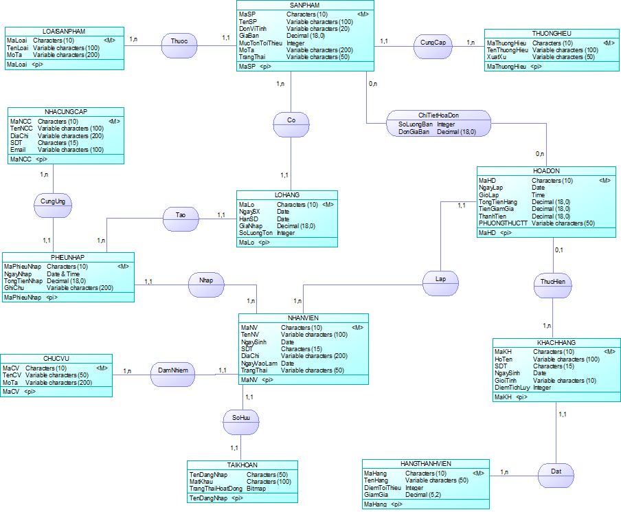
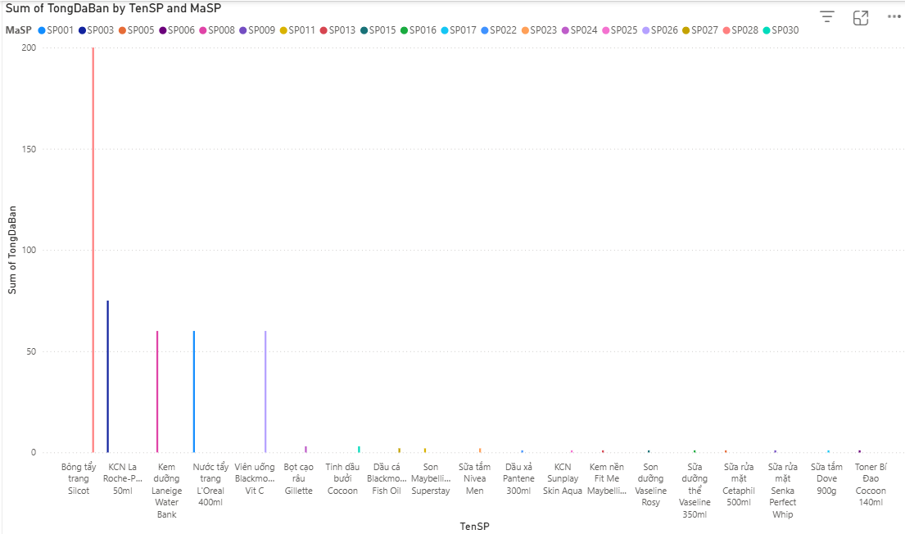
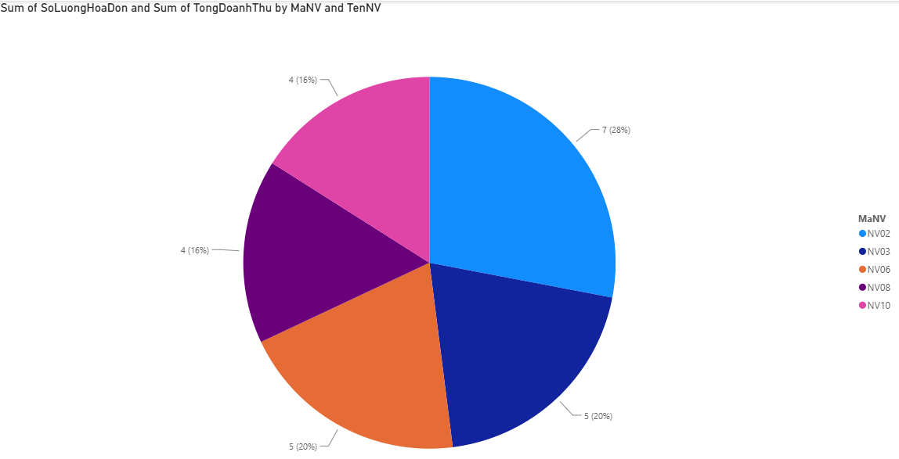
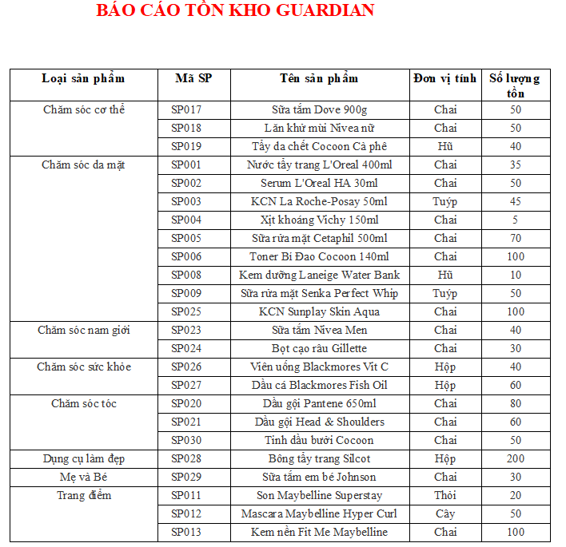

# Guardian Sales Database Management System

Dự án cơ sở dữ liệu quản lý bán hàng Guardian được xây dựng nhằm mô phỏng các nghiệp vụ quản lý sản phẩm, khách hàng, nhân viên, nhập hàng, bán hàng và tồn kho.

Trọng tâm của dự án là phân tích, thiết kế và xây dựng cơ sở dữ liệu trên SQL Server, kết hợp các đối tượng như View, Stored Procedure, Function, Trigger và Transaction để xử lý nghiệp vụ và đảm bảo tính toàn vẹn dữ liệu.

> **Lưu ý:** Đây là dự án học tập mô phỏng hệ thống cơ sở dữ liệu quản lý bán hàng Guardian, được thực hiện phục vụ mục đích học tập và không phải hệ thống chính thức của Guardian.

📄 [Xem báo cáo tóm tắt dự án](report/Bao-cao-tom-tat-du-an-Guardian.pdf)
---

## Chức năng chính

- Quản lý sản phẩm, loại sản phẩm và nhà cung cấp.
- Quản lý khách hàng và nhân viên.
- Quản lý nhập hàng và bán hàng.
- Theo dõi số lượng tồn kho.
- Thống kê dữ liệu bán hàng.
- Phân quyền người dùng theo nhóm Quản lý và Nhân viên.

---

## Công nghệ và công cụ

- **SQL Server:** xây dựng và quản lý cơ sở dữ liệu.
- **PowerDesigner:** thiết kế mô hình dữ liệu.
- **Power BI:** trực quan hóa một số dữ liệu bán hàng cơ bản.
- **Microsoft Report Builder:** xây dựng báo cáo tồn kho cơ bản.

---

## Thành phần cơ sở dữ liệu

Dự án sử dụng các thành phần:

- Tables
- Views
- Stored Procedures
- Functions
- Triggers
- Transactions
- Indexes
- Synonyms
- Phân quyền người dùng

---

## Mô hình dữ liệu

Mô hình dữ liệu được thiết kế phục vụ các nghiệp vụ quản lý sản phẩm, nhà cung cấp, khách hàng, nhân viên, nhập hàng, bán hàng và tồn kho.

### ERD



---

## Trực quan hóa dữ liệu

Một số dữ liệu được trực quan hóa cơ bản bằng Power BI nhằm hỗ trợ quan sát kết quả bán hàng.

### Sản phẩm bán chạy



### Doanh số nhân viên



---

## Báo cáo tồn kho

Microsoft Report Builder được sử dụng để xây dựng báo cáo tồn kho cơ bản từ dữ liệu trong SQL Server.



---

## Hướng dẫn sử dụng

### 1. Khởi tạo cơ sở dữ liệu

Mở SQL Server Management Studio (SSMS), sau đó mở và thực thi file:

```text
database/Quanlybanhang_Guardian.sql
```

### 2. Xem mô hình dữ liệu

Mở file:

```text
model/Guardian.cdm
```

bằng PowerDesigner.

### 3. Xem Power BI

Mở file:

```text
power-bi/Dashboard_Guardian.pbix
```

bằng Microsoft Power BI Desktop.

### 4. Xem báo cáo tồn kho

Mở file:

```text
report-builder/BAOCAOTONKHO_GUARDIAN.rdl
```

bằng Microsoft Report Builder.

Nếu SQL Server trên máy sử dụng instance khác `.\SQLEXPRESS`, cần điều chỉnh Data Source cho phù hợp.

---

## Mục tiêu dự án

Dự án được thực hiện nhằm vận dụng kiến thức về phân tích và thiết kế cơ sở dữ liệu, xây dựng các đối tượng trong SQL Server và xử lý các nghiệp vụ quản lý bán hàng trên cơ sở dữ liệu quan hệ.
